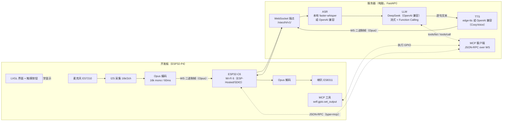
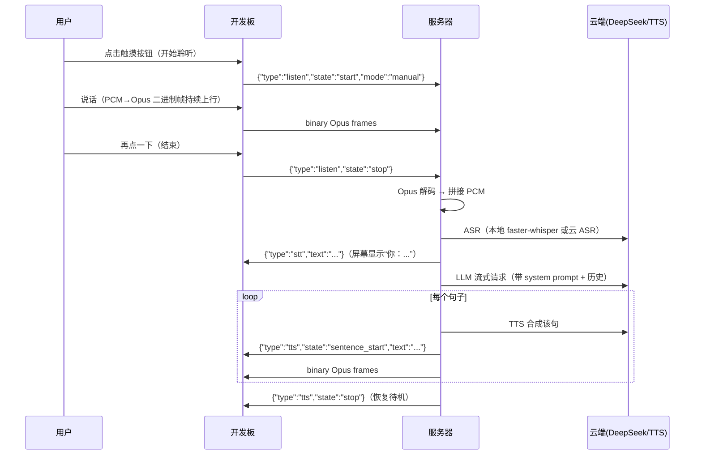
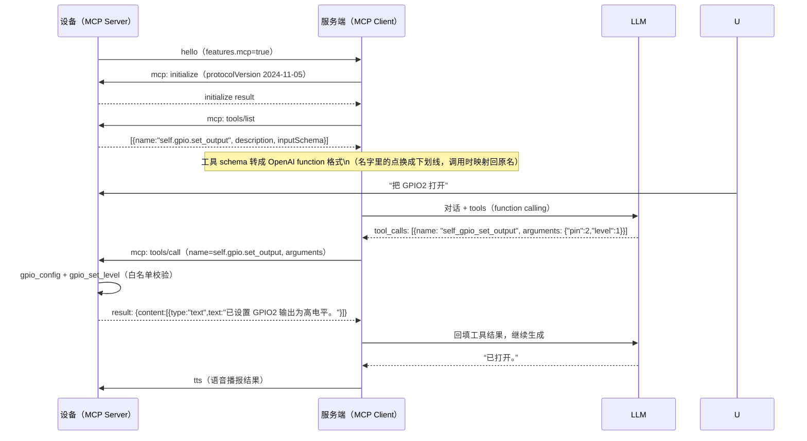

# ESP32-P4 XiaoZhi（TK助手）技术文档

> 本文档描述整个系统的技术实现，重点覆盖四条链路：
> **① 语音识别（ASR）→ ② 大模型调用（LLM）→ ③ 文字转语音（TTS）→ ④ MCP 硬件控制（GPIO）**。
>
> 目标硬件：微雪 **ESP32-P4-WIFI6-Touch-LCD-4.3**（ESP32-P4 rev1.3 + 板载 ESP32-C6 + 4.3" 触摸屏 + ES8311/ES7210 音频）。
> 固件：ESP-IDF（`main/`）；服务端：FastAPI（`server/`）。

---

## 目录

1. [系统总览](#1-系统总览)
2. [交互与音频基础](#2-交互与音频基础)
3. [语音识别 ASR（语音→文字）](#3-语音识别-asr语音文字)
4. [LLM 调用（文字→回答）](#4-llm-调用文字回答)
5. [文字转语音 TTS（文字→语音）](#5-文字转语音-tts文字语音)
6. [MCP 硬件控制（AI 控制 GPIO）](#6-mcp-硬件控制ai-控制-gpio)
7. [配置项总表](#7-配置项总表)
8. [构建、烧录与部署](#8-构建烧录与部署)
9. [已知问题与排查记录](#9-已知问题与排查记录)

---

## 1. 系统总览



**角色分工**

| 模块 | 位置 | 职责 |
|---|---|---|
| 小智协议客户端 | 固件 `main/`（`esp_xiaozhi` 组件） | WebSocket/Opus 收发、hello/listen/tts 消息、MCP 转发 |
| 小智协议服务端 | `server/`（FastAPI） | 收音频→ASR→LLM→TTS→回音频；MCP 客户端；OTA 配置端点 |
| ASR / LLM / TTS | 服务器或云 | 见 §3/§4/§5，均可插拔、无 Key 自动降级 |
| MCP 工具 | 固件 `app_mcp.c` | 设备侧“工具”，供 AI 调用控制硬件 |

**数据通路（一轮完整对话）**



---

## 2. 交互与音频基础

### 2.1 触摸按钮状态机（`main/app_chat.c`）

| 状态 | 屏幕按钮 | 点按行为 |
|---|---|---|
| IDLE | “点击说话” | 发送 `listen start(manual)`，开始麦克风上行 |
| LISTENING | “点击结束” | 发送 `listen stop`，停止上行，服务端开始处理 |
| THINKING | “识别中…”（不可点） | 等待 STT/LLM/TTS（12s 超时保护） |
| SPEAKING | “停止播放” | 发送 `abort` 打断播放 |

### 2.2 音频参数

| 项目 | 值 | 说明 |
|---|---|---|
| I2S/codec 采样率 | 16000 Hz | ES8311/ES7210 以 16k 双声道打开（与微雪官方 I2SCodec 例程一致） |
| 上行（麦克风） | Opus 16k **mono**，60ms/帧，约 24kbps | 双声道降混为单声道后编码 |
| 下行（喇叭） | Opus 16k mono → 解码 PCM → 复制双声道播放 | 解码在独立 `playback_task`（32KB 栈）中完成 |
| 半双工 | 播放 TTS 时麦克风不上行 | 防止扬声器声音被识别成用户说话（无 AEC 的产品策略） |

### 2.3 小智协议（WebSocket）消息速查

| 方向 | 消息 | 内容 |
|---|---|---|
| 设备→服务器 | `hello` | version / transport / audio_params / features(mcp) |
| 服务器→设备 | `hello`(ack) | session_id / transport=websocket / audio_params |
| 设备→服务器 | `listen` | `state=start`（带 mode）/ `state=stop` |
| 设备→服务器 | `abort` | 打断播放（reason=stop_listening 等） |
| 服务器→设备 | `stt` | 识别文字（设备显示为“你：…”） |
| 服务器→设备 | `tts` | `state=start / sentence_start(带文本) / stop` |
| 双向（设备↔服务器） | `mcp` | JSON-RPC 2.0（见 §6） |
| 设备→服务器 | `goodbye` | 会话结束 |
| 双向 | **二进制帧** | Opus 音频数据（上行用户语音 / 下行 TTS） |

关键代码：固件 `managed_components/espressif__esp_xiaozhi/`；服务端 `server/app/session.py`、`server/app/protocol.py`。

---

## 3. 语音识别 ASR（语音→文字）

### 3.1 链路

```
麦克风(ES7210) → I2S 16k/2ch PCM → 降混单声道 → Opus 编码(60ms)
  → WebSocket 二进制帧 → 服务端 Opus 解码 → PCM 缓冲
  → listen stop 触发 → ASR → {"type":"stt","text":"..."} → 设备屏幕显示
```

- 设备上行代码：`main/app_audio.c`（`mic_task`，栈 40KB）
- 服务端收流与触发：`server/app/session.py`（`_on_binary` 累积输入，`_pipeline` 调 ASR）
- 模式：本项目使用 `manual`（点按开始/结束），服务端 VAD 不参与；服务端 `auto` 模式亦支持（能量 VAD 自动断句，适合常听场景）。

### 3.2 识别引擎（服务端可插拔）

| Provider | 说明 | 需要 Key |
|---|---|---|
| **`local`（默认）** | 本机 faster-whisper 离线识别（`server/app/providers/asr.py`），首次运行自动下载模型（国内走 `hf-mirror.com`），已用 `initial_prompt` 强制输出简体中文 | 否 |
| `openai` | OpenAI 兼容 `/audio/transcriptions`（硅基流动 SenseVoice、Groq、OpenAI…） | 是（`XZ_ASR_API_KEY`） |
| `mock` | 固定文本，用于无 Key 自测链路 | 否 |

本机实测（i9-14900K，CPU int8，模型 small）：3.7s 语音 ≈ 1.7s 出字。模型可调 `tiny/base/small/medium/large-v3`；装 `nvidia-cublas-cu12` + `nvidia-cudnn-cu12` 后可 `XZ_ASR_DEVICE=auto` 自动用 GPU。

### 3.3 配置

```dotenv
XZ_ASR_PROVIDER=local        # local | openai | mock
XZ_ASR_LOCAL_MODEL=small     # local 生效：tiny/base/small/medium/large-v3
XZ_ASR_DEVICE=auto           # auto | cpu | cuda
XZ_ASR_LANGUAGE=zh
# 云 ASR（可选）：
# XZ_ASR_PROVIDER=openai
# XZ_ASR_BASE_URL=https://api.siliconflow.cn/v1
# XZ_ASR_API_KEY=<key>
# XZ_ASR_MODEL=FunAudioLLM/SenseVoiceSmall
```

---

## 4. LLM 调用（文字→回答）

### 4.1 调用方式

- **流式**（SSE `stream=true`）调用 DeepSeek 的 OpenAI 兼容接口 `/chat/completions`；
- 服务端对增量文本按标点**切句**，每句立即送 TTS（降低首句延迟）；
- 携带会话历史（最近 20 条 + system prompt）；
- **Function Calling**：当设备上报了 MCP 工具（见 §6），请求里带 `tools`，模型决定是否调用硬件工具。

代码：`server/app/providers/llm.py`（`stream_chat` 产出 `text` / `tool_calls` 事件），`server/app/session.py::_pipeline`（多轮工具循环）。

### 4.2 System Prompt（当前默认）

> 你叫TK助手，是一个运行在 ESP32 上的语音助手。回答要口语化、简洁，适合朗读，通常不超过三句话，不要使用 Markdown 或表情符号。始终使用简体中文回答，不要使用繁体字。当用户想控制开发板上的硬件（开关灯、继电器等）时，调用提供的工具去执行，并简短地告诉用户执行结果。

### 4.3 配置

```dotenv
XZ_LLM_PROVIDER=deepseek
XZ_LLM_BASE_URL=https://api.deepseek.com
XZ_LLM_MODEL=deepseek-chat
XZ_LLM_API_KEY=<你的 DeepSeek Key>
XZ_LLM_TEMPERATURE=0.7
XZ_LLM_MAX_TOKENS=512
# 工具调用节奏（见 §6）
XZ_LLM_TOOL_MAX_ROUNDS=4
XZ_LLM_TOOL_FILLER=好的，我来处理。
```

未配置 Key 时自动降级为 `mock`（固定文本），链路仍可完整自测。

---

## 5. 文字转语音 TTS（文字→语音）

### 5.1 链路

```
LLM 逐句文本 → TTS 合成(16k mono PCM) → Opus 编码(60ms/帧)
  → WS 二进制帧 → 设备 Opus 解码 → PCM 双声道 → I2S → ES8311 → 喇叭
```

- 服务端：`server/app/providers/tts.py`（合成）、`server/app/audio.py`（Opus 编码）
- 设备：`main/app_audio.c`（`app_audio_play_opus` 只做入队；`playback_task` 解码 + 播放）

### 5.2 合成引擎（服务端可插拔）

| Provider | 说明 | 需要 Key |
|---|---|---|
| **`edge`（默认）** | 微软 Edge 在线语音（edge-tts），中文效果好、免费；需要能访问微软服务 | 否 |
| `openai` | OpenAI 兼容 `/audio/speech`（推荐硅基流动 CosyVoice2，16k） | 是（`XZ_TTS_API_KEY`） |
| `mock` | 蜂鸣音，用于离线自测 | 否 |

**自动兜底**：把 `XZ_TTS_PROVIDER` 保持 `edge` 并额外填 `XZ_TTS_API_KEY`（含 base_url/model/voice）时，edge 连接失败会在本会话内自动切到 OpenAI 兼容 TTS（`FallbackTTS`）。

> 注意：edge-tts 依赖外网；若网络受限，直接用硅基流动 CosyVoice（配置见 `.env.example` 注释）。

### 5.3 播放侧要点（设备）

- 协议回调运行在 **websocket_task（4KB 栈）**：只做「拷贝到 PSRAM + 入队」（`app_audio_play_opus`），严禁在此解码；
- 解码与 I2S 写入都在独立 `playback_task`（32KB 栈）：`esp_opus_dec_decode()` → 单声道复制为双声道 → `esp_codec_dev_write()`；
- `tts stop` / 用户打断时清空播放队列（`app_audio_flush_playback`）。

---

## 6. MCP 硬件控制（AI 控制 GPIO）

### 6.1 架构：设备是 Server，服务端是 Client



关键代码：
- 设备：`main/app_mcp.c`（工具注册）、`main/app_chat.c`（会话内启用）；底层 `espressif/mcp-c-sdk` + `esp_xiaozhi` 组件转发
- 服务端：`server/app/session.py::McpClient`（请求/响应 id 配对、5s 超时、hello 后重试 initialize 最多 4 次——因为设备在 hello 之后才创建 MCP manager）；`_llm_tools()` / `_execute_tool()`

### 6.2 设备端工具清单

| 工具名 | 参数 | 说明 |
|---|---|---|
| `self.gpio.set_output` | `pin` (0-54，需在白名单内)、`level` (0/1) | 将指定 GPIO 配置为输出并设置电平；返回中文结果文本 |

**可用引脚白名单**（`app_mcp.c`，40PIN 排针引出的 IO）：
`2, 3, 4, 5, 21, 22, 24, 25, 28, 29, 30, 31, 32, 34, 35, 37, 38, 46, 47, 48, 49, 50, 51, 52`

> ⚠️ 注意事项：
> - **37/38** 与串口控制台（USB-UART/CH343）复用，驱动它们可能影响日志/烧录；
> - **24/25** 是 USB 全速功能脚，不接 USB 时可当普通 GPIO；
> - 板载外设占用的 IO 不在白名单内：I2C(7/8)、I2S(9-13)、LCD(26/27)、SD(39-44)、复位(54) 等。

### 6.3 硬件接线示例（LED）

```
GPIOxx ── 220Ω ── LED(+) ── LED(-) ── GND
```
对 AI 说“把 GPIO2 打开/关掉”，用万用表可量到 **3.3V / 0V**。

### 6.4 增加新工具（示例：读按键 / 控继电器 / 调音量）

1. 设备侧在 `app_mcp.c` 仿照现有工具：`esp_mcp_tool_create(...)` 创建工具与属性，回调里执行硬件操作并返回 `esp_mcp_value_create_string(...)`；
2. 服务端**无需改动**：工具在每次 `hello` 后自动 `tools/list` 发现，并按 function calling 交给模型。

### 6.5 配置

```dotenv
XZ_MCP_ENABLED=true
XZ_MCP_REQUEST_TIMEOUT=5      # 单次 JSON-RPC 超时（秒）
XZ_MCP_INIT_RETRY=4           # hello 后 initialize 重试次数
```

---

## 7. 配置项总表

### 7.1 服务端 `server/.env`（从 `.env.example` 复制）

| 变量 | 默认 | 说明 |
|---|---|---|
| `XZ_LLM_PROVIDER/BASE_URL/MODEL/API_KEY` | deepseek / api.deepseek.com / deepseek-chat | §4；Key 必填才启用真实回答 |
| `XZ_ASR_PROVIDER` | local | §3；`local` 无需 Key |
| `XZ_ASR_LOCAL_MODEL` / `XZ_ASR_DEVICE` | small / auto | 本地识别模型与设备 |
| `XZ_TTS_PROVIDER` | edge | §5；edge 免费，网络受限时换 openai |
| `XZ_TTS_*`（BASE_URL/API_KEY/MODEL/VOICE） | 空 | OpenAI 兼容 TTS / edge 兜底 |
| `XZ_MCP_ENABLED` / `XZ_MCP_REQUEST_TIMEOUT` / `XZ_MCP_INIT_RETRY` | true / 5 / 4 | §6 |
| `XZ_LLM_TOOL_MAX_ROUNDS` / `XZ_LLM_TOOL_FILLER` | 4 / “好的，我来处理。” | 工具调用轮数上限 / 垫场话 |

### 7.2 固件 menuconfig（`idf.py menuconfig`）

| 配置项 | 默认 | 说明 |
|---|---|---|
| `XiaoZhi Assistant App → Wi-Fi SSID/Password` | - | 2.4G Wi-Fi（C6 不支持 5G） |
| `XiaoZhi Assistant App → Speaker volume` | 75 | 喇叭音量 0-100 |
| `XiaoZhi Assistant App → Microphone gain` | 18 dB | 识别不灵可调大（24/30），噪声大调小 |
| `Xiaozhi Assistant → Default OTA URL` | - | 服务器地址：`http://<电脑IP>:8000/xiaozhi/ota/` |

固件私有配置也可写在 `sdkconfig.defaults.local`（已 gitignore），构建时：
`SDKCONFIG_DEFAULTS="sdkconfig.defaults;sdkconfig.defaults.local"`。

---

## 8. 构建、烧录与部署

### 8.1 版本策略（重要）

| 组件 | 版本 | 原因 |
|---|---|---|
| ESP-IDF | **5.5.4**（推荐 5.5.1~5.5.4） | 微雪 FAQ 推荐；与出厂 C6 固件兼容的 Hosted 线匹配 |
| esp_hosted / esp_wifi_remote | **1.4.7 / 0.14.5** | 与板载 C6 **出厂固件**匹配（与微雪出厂 brookesia 固件一致） |
| esp_audio_codec | 2.4.1 | 出厂同版本；2.6+ 要求 P4 rev≥3，本板 rev1.3 不适用 |
| esp_xiaozhi | ^0.1.2 | 小智协议组件（IDF≥5.5） |
| LVGL | 9.5（由 BSP 拉取） | 屏幕/触摸/字体 |

> ⚠️ **不要**把 esp_hosted 升级到 2.x（除非同时升级 C6 固件）：实测 2.12 主机 + 出厂 C6 固件在音频突发流量下会出现 SDIO 超时并触发设备重启，详见 §9.1。

### 8.2 固件构建/烧录

```powershell
# 激活 ESP-IDF 环境后，在项目根目录：
idf.py set-target esp32p4        # 首次
idf.py menuconfig                # 改 Wi-Fi / OTA URL（或用 sdkconfig.defaults.local）
idf.py build
idf.py -p COMx flash monitor     # COMx 为 USB-UART 口（CH343）
```

- 分区表 `partitions.csv`：4MB→已扩为 **8MB app**（内置全量中文字库）+ 1MB storage；
- 中文全量字库（覆盖 U+4E00–U+9FFF 全部汉字）由 `tools/gen_font.ps1` 生成（Source Han Sans SC，OFL），产物 `main/assets/font_tk_16.c` 直接编译进固件，需 `LV_FONT_FMT_TXT_LARGE=y`。

### 8.3 服务端部署

```powershell
cd server
copy .env.example .env            # 填 Key（或直接用 local ASR 无需 Key）
.venv\Scripts\python.exe -m app.main   # 或 .\run.ps1
# 放行防火墙 8000（管理员 PowerShell）：
New-NetFirewallRule -DisplayName "Xiaozhi Server 8000" -Direction Inbound -Protocol TCP -LocalPort 8000 -Action Allow
```

自检：浏览器打开 `http://<电脑IP>:8000/health`；冒烟测试 `python tools/ws_smoke_test.py`（模拟设备跑一遍 hello→说话→回答）。

---

## 9. 已知问题与排查记录

### 9.1 设备播放 TTS 时反复重启（SDIO 超时）— 已定位

**现象**：对话正常，TTS 音频播放一两句后设备重启。

**根因**：`ESP-Hosted` 的 SDIO 链路（P4↔C6）在音频突发流量下写入超时：

```
E H_SDIO_DRV: sdio_write_task: Failed to send data: 258 66 66
E H_SDIO_DRV: Unrecoverable host sdio state
I os_wrapper_esp: Restarting host
```

每次启动早就有伏笔：`Version mismatch: Host [2.12.0] > Co-proc [0.0.0] ==> Upgrade co-proc to avoid RPC timeouts`——**C6 出厂固件比主机驱动旧**。

**解决**：主机侧切到与出厂 C6 固件匹配的 **esp_hosted 1.4.7 / esp_wifi_remote 0.14.5**（+ ESP-IDF 5.5.4）。
（备选：升级 C6 固件后可使用 2.x 主机线；C6 升级需要从 4PIN 焊盘接 USB-TTL 烧录，见微雪 FAQ。）

### 9.2 字库缺字 / 乱码

- 内置的 `lv_font_source_han_sans_sc_16_cjk` 是**手工挑字子集**，很多常用字缺失；
- 现改为 `tools/gen_font.ps1` 生成**全量字库**（`main/assets/font_tk_16.c`，20992 个汉字 + 标点/全角，4bpp）；
- 历史上用过「运行时 bin 字库（lv_binfont + memfs）」方案出现过渲染异常，已弃用，改为编译期 C 字库（最稳妥路径）。

### 9.3 繁简混用

- Whisper 转写易出繁体 → 已在 ASR 加 `initial_prompt="以下是普通话的句子，请使用简体中文转写。"`；
- LLM 偶发繁体 → system prompt 已加“始终使用简体中文”。

### 9.4 edge-tts 连不上

微软服务在国内网络可能超时。方案：填 `XZ_TTS_API_KEY`（OpenAI 兼容，推荐硅基流动 CosyVoice2）自动兜底，或直接 `XZ_TTS_PROVIDER=openai`。

### 9.5 P4 芯片版本（rev1.3）

烧录报 `requires chip revision in range [v3.1 - v3.99]` 时，确认 `CONFIG_ESP32P4_REV_MIN_100=y`（IDF 6 还需 `CONFIG_ESP32P4_SELECTS_REV_LESS_V3=y`）。

### 9.6 websocket_task 栈溢出（MCP tools/list）— 已修复

**现象**：设备连上服务器后约 1 秒重启（IDF 5.5 固件），崩溃于：

```
Guru Meditation Error: Core 0 panic'ed (Stack protection fault)
Detected in task "websocket_task"   # 溢出点: newlib __ssprint_r / vsnprintf
Stack bounds: 0x4ff304e0 - 0x4ff314d0   # 仅 4KB
```

**根因**：`esp_xiaozhi` 初始化 websocket 客户端时未设置 `task_stack`，`esp_websocket_client` 默认 **4KB**；处理 MCP `tools/list` 响应（构建并打印 JSON）时栈不够（IDF 5.5 的 newlib printf 栈帧比 6.x 大，因此 6.x 上侥幸没炸）。

**修复**：给 websocket 客户端配置 `.task_stack = 8192`（修改在 `managed_components/espressif__esp_xiaozhi/src/esp_xiaozhi_websocket.c`）。组件重新下载后补丁会丢失——已提供**幂等恢复脚本 `tools/apply_patches.ps1`**，组件更新后运行一次即可。

---

## 附：关键文件索引

| 功能 | 文件 |
|---|---|
| 固件入口 / 任务编排 | `main/app_main.c`、`main/app_chat.c` |
| 音频（采集/编码/解码/播放） | `main/app_audio.c` |
| 界面（LVGL + 触摸按钮 + 字体） | `main/app_ui.c`、`main/assets/font_tk_16.c` |
| MCP 工具（GPIO） | `main/app_mcp.c` |
| Wi-Fi（C6/Hosted） | `main/app_wifi.c` |
| 服务端协议/会话/流水线/MCP 客户端 | `server/app/session.py`、`server/app/protocol.py` |
| ASR / LLM / TTS providers | `server/app/providers/{asr,llm,tts}.py`、`server/app/audio.py` |
| 服务端配置 | `server/app/config.py`、`server/.env.example` |
| 字库生成脚本 | `tools/gen_font.ps1` |
| 原厂组件补丁恢复脚本 | `tools/apply_patches.ps1` |
| 冒烟测试 | `server/tools/ws_smoke_test.py` |
